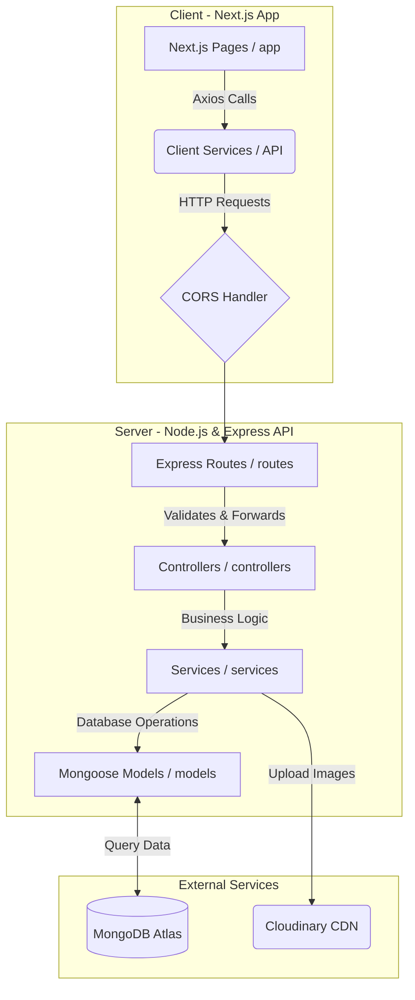

# 🚀 AffNet v2 - Complete Deployment & Project Workflow Guide

This document details the architectural design, operational workflow, local setup, and step-by-step deployment instructions for the **AffNet v2** commercial real estate platform.

---

## 🏗️ 1. Project Architecture & Workflow

AffNet v2 is a modern web application built using a decoupled, workspace-based monorepo structure.



### 🔁 Operational Workflows

#### 1. Authentication & Security Workflow
1. **Sign Up**: The administrator signs up via the client. The frontend makes a `POST /api/v1/auth/signup` request. The backend hashes the password using `bcrypt` and saves the user record with the `admin` role in MongoDB.
2. **Sign In**: The user authenticates via `POST /api/v1/auth/signin`. The backend validates credentials, issues a JWT token containing key user details, sets it in an HTTP-Only secure cookie (`authToken`), and returns the payload.
3. **Protected Requests**: For endpoints requiring authorization (e.g., creating/updating properties), the `authMiddleware` reads the authorization header or the HTTP-Only cookie, verifies the JWT, and attaches `userId` to the request object.

#### 2. Property Creation & Image Upload Workflow
1. **Property Ingestion**: Admin submits a property listing form containing specifications (locality, rent, dimensions) and multiple image files.
2. **Multipart Request**: The frontend issues a `POST /api/v1/properties` request using `multipart/form-data`.
3. **Multer Processing**: The server receives the request. The `upload.array("images", 10)` middleware captures the file buffers, temporarily saves them to the server's `./uploads/` directory, and feeds the details to `createPropertyController`.
4. **Cloudinary Integration**: The service uploads images to **Cloudinary** using the Cloudinary Node.js SDK. Cloudinary returns secure HTTPS image URLs and unique public IDs.
5. **MongoDB Persistence**: The backend creates a new `Property` document in MongoDB containing details of the property specifications along with the Cloudinary image objects.

#### 3. Lead Generation Workflow
1. **User Inquiry**: A public site visitor clicks "Enquire Now" on a property page and submits their contact details (name, email, message).
2. **Ingestion**: The frontend invokes `leadAPI.create()`, triggering a `POST /api/v1/leads` request to the backend.
3. **Database Capture**: The backend creates a new `Lead` document, linking it to the specific property ID.
4. **Lead Management**: Administrators access `/admin/leads` in the Next.js application, which queries `GET /api/v1/leads` (leveraging backend pagination & sorting). Administrators can transition lead statuses (e.g., `New`, `Contacted`, `Converted`, `Rejected`) via `PUT /api/v1/leads/:id/status`.

---

## 💻 2. Local Development Setup

To run the client and server locally, follow these instructions:

### Prerequisites
- Node.js (v18 or higher)
- npm (v9 or higher)
- MongoDB instance (local or remote MongoDB Atlas)

### Step 1: Install Dependencies
From the project's root folder, install all required dependencies for the frontend and backend using npm workspaces:
```bash
npm install
```

### Step 2: Configure Backend Environment
Create a `.env` file in the `/server` directory:
```bash
# From root directory
cp server/.env.example server/.env
```
Populate `server/.env` with your settings:
```env
NODE_ENV=development
PORT=5000
DB_URL=mongodb://localhost:27017/affnet  # Or your MongoDB Atlas connection string
JWT_ADMIN_PASSWORD=your_secure_32_character_jwt_secret
CLOUDINARY_CLOUD_NAME=your_cloudinary_cloud_name
CLOUDINARY_API_KEY=your_cloudinary_api_key
CLOUDINARY_API_SECRET=your_cloudinary_api_secret
FRONTEND_URL=http://localhost:3000
```

### Step 3: Configure Frontend Environment
Create or edit `client/.env.local`:
```env
NEXT_PUBLIC_API_URL=http://localhost:5000/api/v1
```

### Step 4: Run Locally
Run both client and server concurrently using the root workspace scripts:
```bash
# Run both projects concurrently
npm run dev:all

# Or run client separately
npm run dev
```
The client will be running on `http://localhost:3000` and the server will listen on `http://localhost:5000`.

---

## 🚀 3. Step-by-Step Deployment Guide

Deploying AffNet v2 involves three stages: database setup, backend API deployment, and frontend client deployment.

### Phase A: Database & Services Setup

#### 1. MongoDB Atlas (Cloud Database)
1. Navigate to [MongoDB Atlas](https://www.mongodb.com/cloud/atlas) and sign in or create a free account.
2. Click **Create a Database** and select the **M0 Shared Free Tier**.
3. Choose your cloud provider and region, then click **Create**.
4. In **Security Quickstart**:
   - Create a database user (e.g., Username: `affnet-user`, Password: copy a secure password). Keep these credentials.
   - Set IP Access List: To allow cloud platforms to connect, add `0.0.0.0/0` (allow access from anywhere) or whitelist specific platform IPs.
5. In your cluster dashboard, click **Connect** -> **Drivers**.
6. Copy your **Connection String**:
   ```
   mongodb+srv://affnet-user:<db_password>@cluster0.xxxx.mongodb.net/?retryWrites=true&w=majority&appName=Cluster0
   ```
   *(Note: Remember to replace `<db_password>` with your database user's password).*

#### 2. Cloudinary Setup (Asset Hosting)
1. Go to [Cloudinary](https://cloudinary.com) and sign up for a free account.
2. Open your Cloudinary Console dashboard.
3. Locate and copy the following credentials:
   - **Cloud Name**
   - **API Key**
   - **API Secret**

---

### Phase B: Deploying the Backend (Express API)

You can deploy the Node.js/Express API to **Render**, **Railway**, or **Heroku**. In this guide, we use **Render** (free-tier friendly).

#### Deploying on Render:
1. Sign in to [Render](https://render.com).
2. Click **New +** and select **Web Service**.
3. Connect your GitHub repository containing the codebase.
4. Set the following service configuration:
   - **Name**: `affnet-backend`
   - **Runtime**: `Node`
   - **Root Directory**: `server`
   - **Build Command**: `npm install && npm run build` (This runs the typescript compiler `tsc -b`)
   - **Start Command**: `node ./dist/server.js`
5. Click **Advanced** and add the following **Environment Variables**:
   - `NODE_ENV`: `production`
   - `PORT`: `10000` (Render binds this dynamically, but configure it just in case)
   - `DB_URL`: *Your MongoDB Atlas connection string*
   - `JWT_ADMIN_PASSWORD`: *Your 32+ character secret*
   - `CLOUDINARY_CLOUD_NAME`: *Your Cloudinary Cloud Name*
   - `CLOUDINARY_API_KEY`: *Your Cloudinary API Key*
   - `CLOUDINARY_API_SECRET`: *Your Cloudinary API Secret*
   - `FRONTEND_URL`: *Your deployed Next.js URL (you will update this once you deploy the frontend, e.g. `https://your-app.vercel.app`)*
6. Click **Create Web Service**. Wait for the logs to say `Server Running Successfully` and copy the public URL of your service (e.g., `https://affnet-backend.onrender.com`).

---

### Phase C: Deploying the Frontend (Next.js)

The frontend client can be deployed to **Vercel** (the creators of Next.js, providing the best compatibility).

#### Deploying on Vercel:
1. Sign in to [Vercel](https://vercel.com).
2. Click **Add New** -> **Project**.
3. Import your GitHub repository.
4. Set the project configuration:
   - **Framework Preset**: `Next.js`
   - **Root Directory**: `client`
5. Open **Build and Development Settings**:
   - Check that the defaults are correct. The build command will execute `next build` which is standard.
6. Open **Environment Variables** and add:
   - Name: `NEXT_PUBLIC_API_URL`
   - Value: `https://affnet-backend.onrender.com/api/v1` *(Replace with your actual Render backend URL)*
7. Click **Deploy**.
8. Once built, Vercel will provide your live deployment URL (e.g., `https://affnet-v2.vercel.app`).

---

### Phase D: Post-Deployment Steps
1. Return to your Render dashboard for the **Backend Service**.
2. Go to **Environment Variables** and edit `FRONTEND_URL` to match your Vercel deployment URL:
   - Name: `FRONTEND_URL`
   - Value: `https://affnet-v2.vercel.app` (do not add a trailing slash `/`)
3. Save the changes. Render will automatically redeploy the backend with the correct CORS origins enabled.
4. Your application is now fully live and ready to use!
